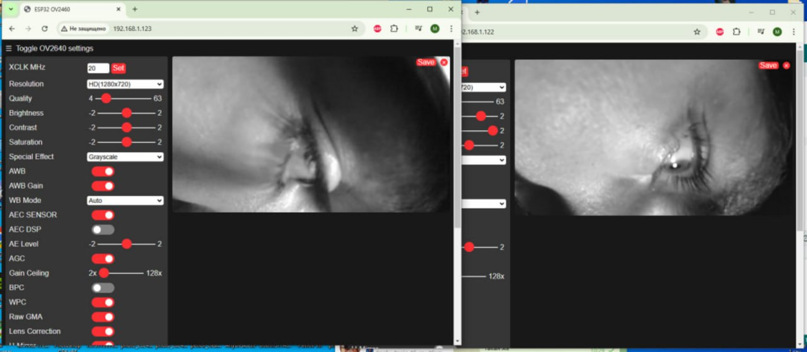
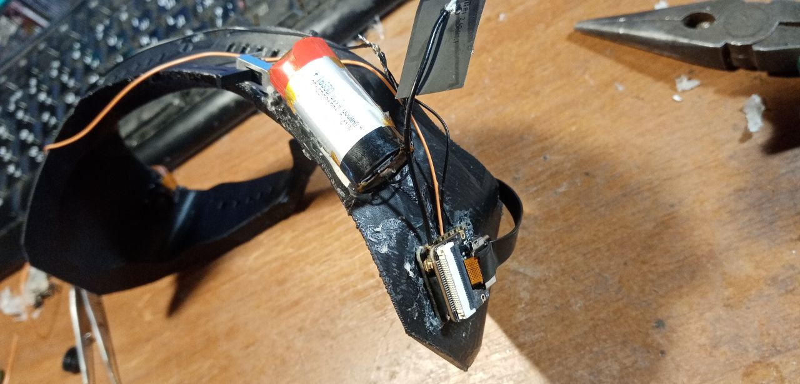
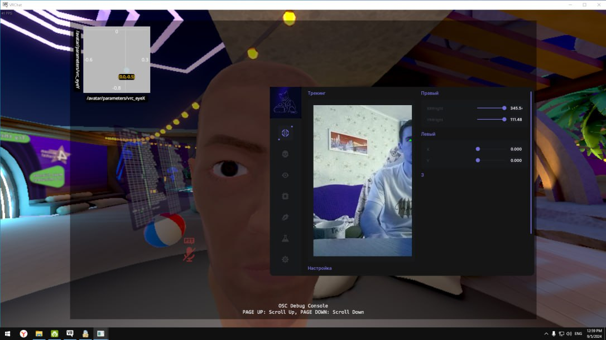
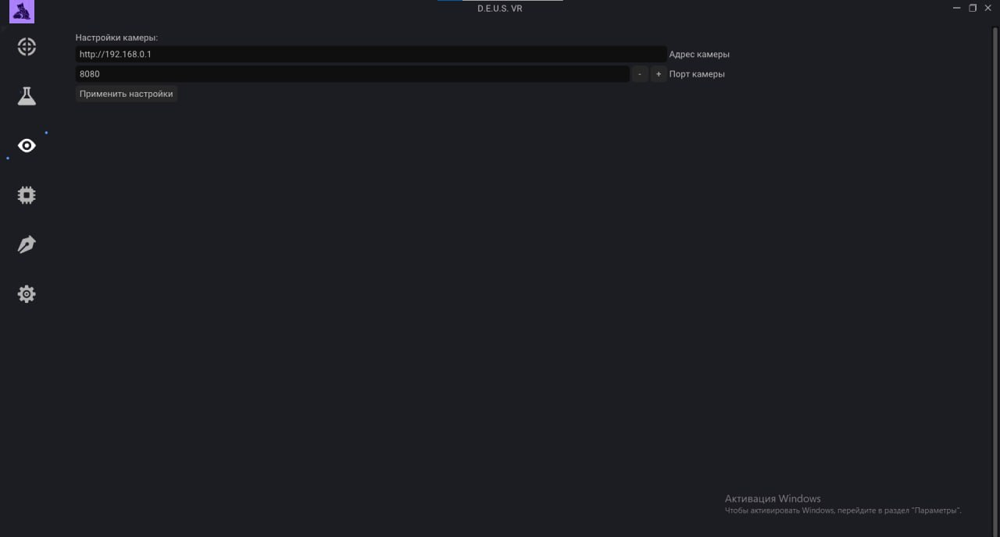

# VRChat-Face-Eye-Tracker

**Автономный C++ трекер мимики и взгляда на базе компьютерного зрения.**  
Система захвата мимики и взгляда с использованием компьютерного зрения, построенная на OpenCV, и Dear ImGui.

---

## 📌 О проекте

**VRChat-Face-Eye-Tracker** — это десктопное приложение, превращающее любую веб-камеру в низкоуровневый трекер лица и глаз для VRChat.  
Проект написан с нуля, чтобы обеспечить полный контроль над каждым этапом обработки: от захвата сырого кадра до отправки OSC-пакета.

### Ключевая философия
- **Минимальные зависимости** — используется только необходимый стек: OpenCV для захвата/обработки, Dear ImGui для UI.
- **Контроль над производительностью** — мы управляем памятью, SwapChain и потоками вручную, без прослоек.
- **Низкая задержка** — пайплайн оптимизирован для сквозной задержки <10 мс (без учета времени работы модели детекции).

---

## ⚡️ Возможности

### 🎯 Трекинг взгляда (Gaze)
- Вычисление 3D-вектора направления взгляда на основе геометрии зрачков и векторов глазных яблок.
- Экспорт параметров: `EyeLookIn`, `EyeLookOut`, `EyeLookUp`, `EyeLookDown`.

### 🗣️ Трекинг рта (Mouth)
- Детекция открытия рта (`JawOpen`), улыбки (`MouthSmile`), нахмуривания (`MouthFrown`), выпячивания губ (`MouthPucker`).
- Используются пропорциональные метрики на основе 468 точек лица.

### 📤 OSC-отправка
- Совместимость с форматом **VRCFaceTracking (Unified Expressions)**.
- Отправка по UDP на `localhost:9000` (стандартный порт VRChat) с кастомной частотой (до 90 Гц).

### 🖥️ Графический интерфейс
- Рендеринг через **Vulkan** (собственный SwapChain, без GLFW-прослоек).
- **Dear ImGui** для отображения видео-потока, наложенных точек лица, графиков параметров и логов в реальном времени.
- Минимальное влияние на производительность (UI обновляется асинхронно).

### 🔧 Калибровка
- Адаптация под анатомию пользователя (межзрачковое расстояние, пропорции лица).
- Сохранение/загрузка профилей в формате JSON.

---

